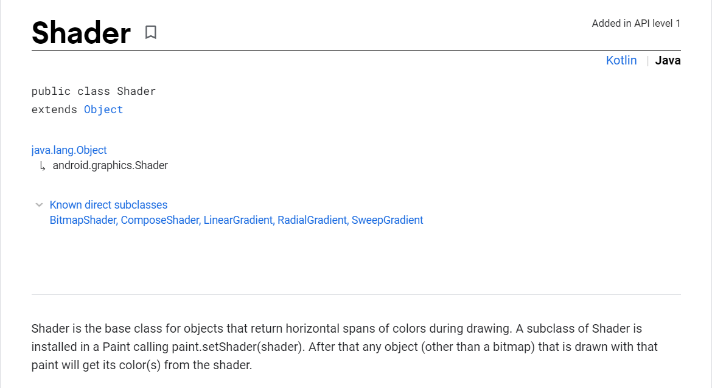

# `TextView`背景、文字、描边渐变色

## 背景渐变色

背景渐变色用到[`形状可绘制对象`](https://developer.android.com/guide/topics/resources/drawable-resource#Transition)

在`drawable`目录下新建根元素为`<shape>`的资源文件，使用`<gradient>`标签设置渐变色。

***`res/drawable/bg_gradient.xml`***

```xml
<?xml version="1.0" encoding="utf-8"?>
<shape xmlns:android="http://schemas.android.com/apk/res/android">
    <gradient
        android:endColor="@color/black"
        android:startColor="@color/red" />
</shape>
```

在布局`xml`中可以使用`android:backgroud`或`android:backgroundTint`属性引用该资源文件：

```xml
<TextView
    android:background="@drawable/gradient_box"
    android:layout_height="wrap_content"
    android:layout_width="wrap_content" />
```

或者在`Java`代码中使用`setBackgroundResource()`：

```java
// 设置背景渐变色
binding.tvText.setBackgroundResource(R.drawable.bg_gradient);
```


## 文字渐变色

文字渐变色用到着色器`Shader`



`Shader`共有`5`个子类：

- `LinearGradient`
- `SweepGradient`
- `RadialGradient`
- `BitmapShader`
- `ComposeShader`

这里用到线性渲染器[`LinearGradient`](https://developer.android.com/reference/android/graphics/LinearGradient)。`TextView.getPaint`获取`TextPaint`实例，调用`setShader`方法设置着色器。

```java
binding.tvText.addOnLayoutChangeListener(new View.OnLayoutChangeListener() {
    @Override
    public void onLayoutChange(View v, int left, int top, int right, int bottom, int oldLeft, int oldTop, int oldRight, int oldBottom) {
        LinearGradient linearGradient = new LinearGradient(0, 0, right - left, 0,
                getResources().getColor(R.color.color_start_1),
                getResources().getColor(R.color.color_end_1),
                Shader.TileMode.CLAMP);
        // 设置着色器
        binding.tvText.getPaint().setShader(linearGradient);
    }
});
```

这里需要注意设置着色器的时机，`LinearGradient`创建实例需要获取控件的宽高，但是在`Activity.onCreate`方法中，控件的实例被创建，但尚未执行完`measure`和`layout`过程，因此获取不到控件的宽高。

除了在`View`完成`measure`和`layout`之前设置布局变化监听器之外还可以使用`View.post`方法，将设置着色器的操作添加到消息队列中。


> 需要注意的是：`LinearGradient`被设置为`TextPaint`的着色器，但是`TextPaint`的绘制范围不一定是文字的绘制范围。所以文字的颜色表现有可能会因为在控件中的位置不同而发生改变：
>
> 
>
> 
>
> 有考虑过仅把渐变范围设置在文本绘制区域即可，那么获取文本绘制区域的宽高和在控件中的绘制位置。
>
> 文本绘制的位置暂时不容易获取到，就此作罢。
>
> 另外在设置了`padding`值的情况下也需要考虑减去相关方向上的`padding`值。
>
> ```java
> binding.tvText.addOnLayoutChangeListener(new View.OnLayoutChangeListener() {
>  @Override
>  public void onLayoutChange(View v, int left, int top, int right, int bottom, int oldLeft, int oldTop, int oldRight, int oldBottom) {
>      int paddingStart = binding.tvText.getPaddingStart();
>      int paddingEnd = binding.tvText.getPaddingEnd();
>      int paddingTop = binding.tvText.getPaddingTop();
>      int paddingBottom = binding.tvText.getPaddingBottom();
>      LinearGradient linearGradient
>          = new LinearGradient(0, 0, right - left - paddingStart - paddingEnd, 0,
>                               getResources().getColor(R.color.color_start_1),
>                               getResources().getColor(R.color.color_end_1),
>                               Shader.TileMode.CLAMP);
>      binding.tvText.getPaint().setShader(linearGradient);
>  }
> });
> ```


## 边框渐变色

绘制边框渐变色有两种方式：

**1.使用图层列表`<layer-list>`**

```xml
<?xml version="1.0" encoding="utf-8"?>
<layer-list xmlns:android="http://schemas.android.com/apk/res/android">
    <!-- 绘制渐变色 -->
    <item>
        <shape>
            <gradient
                android:endColor="@color/color_end_1"
                android:startColor="@color/color_start_1" />
        </shape>
    </item>

    <!-- 纯色填充覆盖中间部分，四周留出空间展示渐变色边框 -->
    <item
        android:bottom="5dp"
        android:left="5dp"
        android:right="5dp"
        android:top="5dp">
        <shape>
            <solid android:color="@color/white" />
        </shape>
    </item>
</layer-list>
```

 第一个`<item>`绘制渐变色；第二个`<item>`的四周留出`5dp`的空间，并填充颜色覆盖中间部分的渐变色。

但是这种方式不适合仅需要边框渐变色而不需要背景色填充的场景。


**2.自定义`View`绘制边框**

```java
/**
 * Created by RabbitFeng on 2022/2/10
 */
public class GradientTextView extends AppCompatTextView {
    private static final String TAG = GradientTextView.class.getSimpleName();

    private float[] position = new float[]{0f, 1f};
    /**
     * 边框渐变色
     */
    private int[] colorBorder = new int[2];
    /**
     * 边框着色器
     */
    private Shader shaderBorder;
    /**
     * 绘制边框画笔
     */
    private Paint paintBorder;
    /**
     * 描边
     */
    private float strokeWidthBorder;
    /**
     * 边缘矩形范围
     */
    private RectF rectFBorder;

    public GradientTextView(@NonNull Context context) {
        super(context);
        init(null);
    }

    public GradientTextView(@NonNull Context context, @Nullable AttributeSet attrs) {
        super(context, attrs);
        init(attrs);
    }

    public GradientTextView(@NonNull Context context, @Nullable AttributeSet attrs, int defStyleAttr) {
        super(context, attrs, defStyleAttr);
        init(attrs);
    }

    private void init(@Nullable AttributeSet attrs) {
        // 初始化颜色值
        colorBorder[0] = Color.parseColor("#FF65FDF0");
        colorBorder[1] = Color.parseColor("#FF1D6FA3");

        // 初始化描边宽度
        strokeWidthBorder = TypedValue.applyDimension(TypedValue.COMPLEX_UNIT_DIP, 10, getResources().getDisplayMetrics());

        if (attrs != null) {

        }

        paintBorder = new Paint(Paint.ANTI_ALIAS_FLAG);
        paintBorder.setStrokeWidth(strokeWidthBorder);
        paintBorder.setStyle(Paint.Style.STROKE);

        setLayerType(LAYER_TYPE_SOFTWARE, null);
    }

    @Override
    protected void onSizeChanged(int w, int h, int oldw, int oldh) {
        super.onSizeChanged(w, h, oldw, oldh);
        if (w == 0 || h == 0) {
            return;
        }

        int borderShift = Math.round(strokeWidthBorder / 2);
        rectFBorder = new RectF(borderShift, borderShift, w - borderShift, h - borderShift);

        shaderBorder = new LinearGradient(0, 0, w, 0, colorBorder, position, Shader.TileMode.CLAMP);
        paintBorder.setShader(shaderBorder);

        postInvalidate();
    }

    @Override
    protected void onDraw(Canvas canvas) {
        drawBorder(canvas);
        super.onDraw(canvas);

    }

    /**
     * 绘制边缘
     */
    private void drawBorder(Canvas canvas) {
        canvas.drawRect(rectFBorder, paintBorder);
    }
}
```